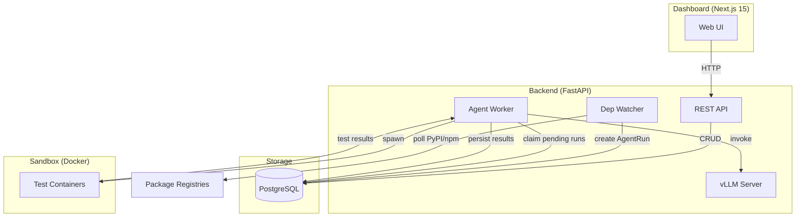
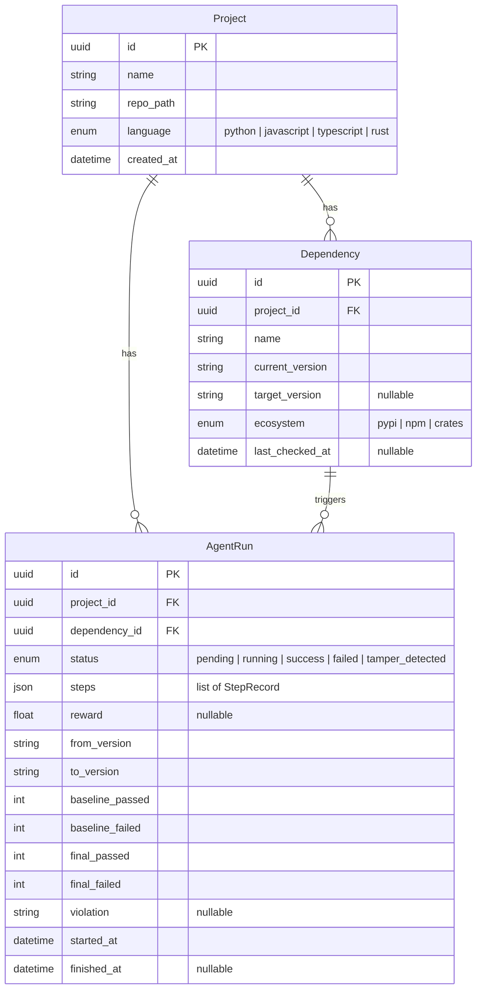
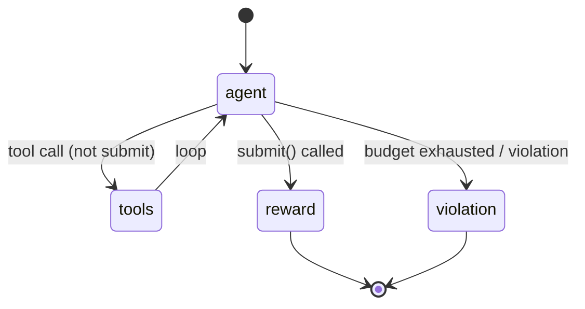
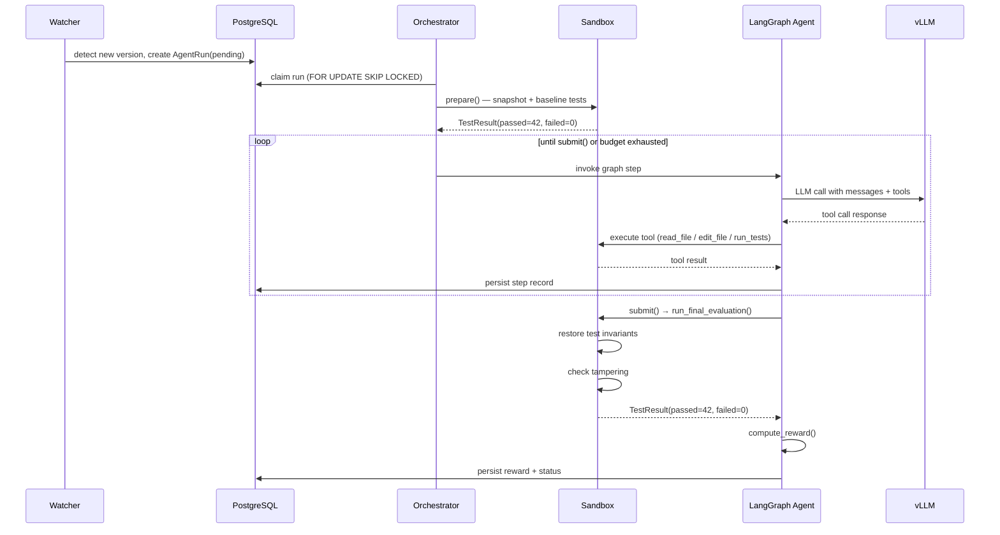

# Architecture

> Deep dive into Graft's system design, data flow, and component responsibilities.

---

## System overview

Graft is a closed-loop autonomous system for dependency upgrades. It consists of four major subsystems:



---

## Data model



### StepRecord (denormalised in `AgentRun.steps` JSON)

```json
{
  "step_no": 3,
  "tool": "edit_file",
  "args": {"path": "src/client.py", "old_str": "...", "new_str": "..."},
  "result": "Applied edit to src/client.py",
  "timestamp": "2026-05-02T04:30:00Z",
  "duration_ms": 42
}
```

---

## Component deep dives

### 1. Dependency watcher

The watcher runs on an APScheduler `AsyncIOScheduler` with a configurable interval (default: 15 minutes).

**PyPI poller** (`backend/watcher/pypi.py`):
- Primary: PyPI JSON API (`/pypi/{name}/json`) — parses all release versions, filters pre-releases, returns the highest stable version
- Fallback: PyPI RSS feed (`/rss/project/{name}/releases.xml`) — parsed with `feedparser`

**npm poller** (`backend/watcher/npm.py`):
- Hits the npm dist-tags endpoint (`/-/package/{name}/dist-tags`)
- Returns the version under the `latest` tag

When a newer version is detected:
1. `Dependency.target_version` is set
2. A check ensures no pending/running `AgentRun` already exists for this dep
3. A new `AgentRun` is created with `status=pending`
4. The background worker picks it up

### 2. Agent worker (orchestrator)

The orchestrator (`backend/agent/orchestrator.py`) is an async background task that:

1. **Polls** the database every 3 seconds for pending runs
2. **Claims** a run using `SELECT ... FOR UPDATE SKIP LOCKED` for safe concurrency
3. **Snapshots** the repo into a temporary workspace via `SandboxRunner.prepare()`
4. **Runs the baseline** test suite to establish pass/fail counts
5. **Builds** a LangGraph episode with the initial state
6. **Executes** the graph in a thread (to avoid blocking the event loop)
7. **Streams** step records into the database via an `on_step` callback (wired through `asyncio.run_coroutine_threadsafe`)
8. **Persists** the final reward, status, and test counts

### 3. LangGraph agent

The agent is defined as a `StateGraph` in `backend/agent/graph.py`.



**State schema (`GraftState`)**:
- `run_id`, `repo_path`, `dep_name`, `from_version`, `to_version` — context
- `baseline_passed`, `baseline_failed` — from sandbox preparation
- `messages` — full LangChain message history (uses `add_messages` reducer)
- `steps_taken`, `max_steps` — budget tracking
- `submitted`, `final_reward`, `violation` — termination signals

**Nodes**:
| Node | Responsibility |
|------|---------------|
| `agent` | Invoke LLM with current messages + tool definitions |
| `tools` | Execute tool calls, append results, update step count |
| `reward` | Run final evaluation in fresh container, compute reward |
| `violation` | Set reward = -1.0 and record violation reason |

**Routing** (`route_from_agent`):
1. If sandbox has a violation → `violation`
2. If `submitted=True` → `reward`
3. If `steps_taken >= max_steps` → `violation`
4. If last message has tool calls → `tools`
5. Otherwise → `violation`

### 4. Tool system

Tools are defined as LangChain `StructuredTool` objects with Pydantic arg schemas. They access the current run's workspace via `current_session()` (a `ContextVar`-backed function).

**Security boundaries**:
- `edit_file` checks `_is_test_path()` before writing — rejects edits to test files and configs
- `_safe_resolve()` prevents path traversal outside the workspace
- `grep_repo` and `ast_query` cap results at 200 matches

### 5. Sandbox

`SandboxRunner` (`backend/sandbox/runner.py`) manages one workspace per agent run.

**Lifecycle**:
1. `prepare()` — copy repo, hash `tests/`, hash config files, count skip markers, run baseline
2. Agent edits files in the workspace
3. `run_tests()` — observational, checks for tampering first
4. `run_final_evaluation()` — restores test invariants from original, runs in fresh container

**Tampering detection** (at every `run_tests()` and at final evaluation):
1. Re-hash `tests/` directory tree — compare against snapshot
2. Re-hash test config files — compare against snapshot
3. Count Python skip markers via AST walking — compare against baseline
4. For `pyproject.toml`: only flag if `[tool.pytest.*]` section changed

**Docker execution**:
- Mounts workspace as `/workspace` (read-write)
- Applies CPU (`nano_cpus`) and memory (`mem_limit`) constraints
- Wraps command with `timeout` to enforce time limits
- Falls back to local `subprocess.run` if Docker is unavailable

### 6. Model loading & vLLM

**Checkpoint priority** (`backend/agent/model_loader.py`):
1. GRPO — scan `GRPO_CHECKPOINT_DIR` for `batch_*/` directories, pick highest-numbered one with `adapter_config.json` or `config.json`
2. SFT — check `SFT_CHECKPOINT_DIR` for a valid checkpoint
3. Base — fall back to `TRAINING_BASE_MODEL` (HuggingFace Hub)

Can be overridden with `FORCE_MODEL_SOURCE`.

**vLLM server** (`backend/agent/vllm_server.py`):
- Started as a child process during FastAPI lifespan
- For LoRA checkpoints (SFT/GRPO): passes `--enable-lora --lora-modules graft-agent={path}` on top of the base model
- For base model: passes `--served-model-name graft-agent`
- Health-checked with a 120-second deadline
- URL stored on `app.state.vllm_url`

### 7. Frontend

The Next.js 15 dashboard provides three pages:

| Page | Path | Key features |
|------|------|-------------|
| Dashboard | `/` | Summary cards, recent runs table, register project button |
| Project detail | `/projects/[id]` | Metadata, dependency table, run history, "Check now" button |
| Run detail | `/runs/[id]` | Step trace timeline (polls every 2s while running), test results, violation banner |

**Data fetching**: SWR with typed `fetcher` function. Active runs are polled via `refreshInterval: 2000`.

**Components**:
- `StatusBadge` — colour-coded status indicator
- `RewardScore` — green (≥0.8), amber (0.4–0.8), red (<0.4)
- `StepTrace` — vertical timeline of tool calls with expandable results
- `VersionBadge` — arrow between versions
- `RegisterProjectForm` — slide-over form with validation

---

## Sequence diagram: full upgrade episode



---

## Security model

1. **No external LLM calls.** All inference is local via vLLM.
2. **Workspace isolation.** Each run gets a temp directory; path traversal is blocked.
3. **Immutable tests.** Test files are restored from the original before final evaluation.
4. **Resource limits.** Sandbox containers are CPU/memory capped.
5. **No hardcoded secrets.** All credentials flow through env vars via `pydantic-settings`.
6. **Docker socket.** The backend requires the Docker socket for sandbox execution — in production, consider a dedicated sandbox service.
