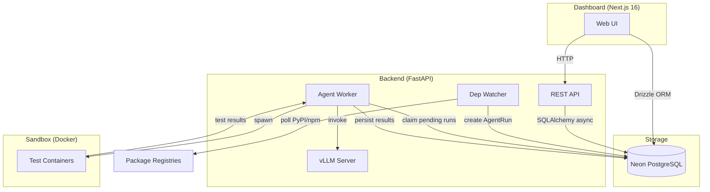
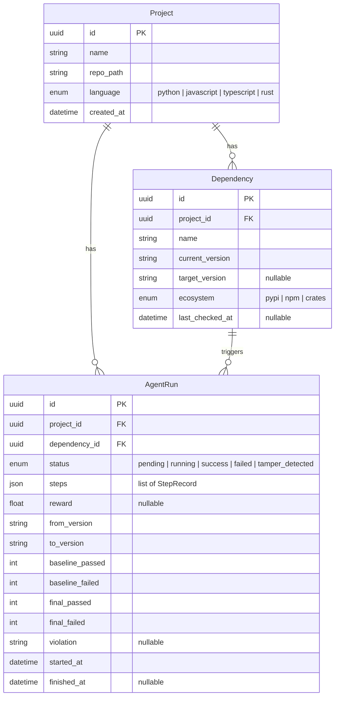
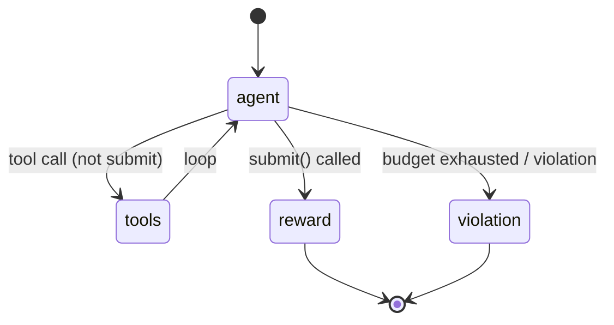
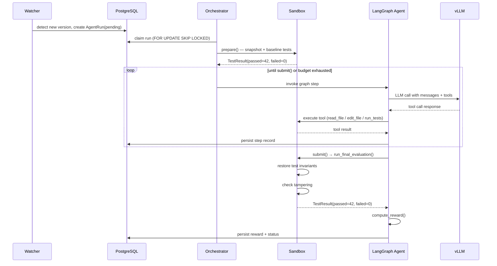

# Architecture

> Deep dive into Graft's system design, data flow, and component responsibilities.

---

## System overview

Graft is a closed-loop autonomous system for dependency upgrades. It consists of four major subsystems:



### Production deployment (HF Spaces)

In production, everything runs inside a single Docker container on HF Spaces with an Nginx reverse proxy on port 7860:

```
┌──────────────────────────────────────────────────────────────────┐
│  HF Spaces — NVIDIA L4 (24 GB)                                  │
│                                                                  │
│  ┌──────────────┐                                                │
│  │ Nginx :7860  │ ──/backend/──► FastAPI :8000                   │
│  │              │ ──/──────────► Next.js :3000                   │
│  └──────────────┘                                                │
│                      ┌─────────────┐   ┌─────────────────────┐   │
│                      │ vLLM :8001  │   │  Agent Worker +     │   │
│                      │ graft-agent │   │  Dep Watcher        │   │
│                      └─────────────┘   └─────────────────────┘   │
│                                                                  │
│  ┌──────────────┐                                                │
│  │ Neon PG      │◄──────── asyncpg+SSL (backend)                 │
│  │ (external)   │◄──────── @neondatabase/serverless (frontend)   │
│  └──────────────┘                                                │
└──────────────────────────────────────────────────────────────────┘
```

The root `Dockerfile` builds Next.js in a builder stage, then combines it with the Python backend, Nginx, and an `entrypoint.sh` that starts all services.

---

## Data model



The frontend (Next.js) has its own Drizzle ORM schema in `apps/web/lib/db/schema.ts` that includes Better Auth tables (user, session, account, verification, organisation, member, invitation) plus an application-level `dependency` table for webhook-driven updates.

### StepRecord (denormalised in `AgentRun.steps` JSON)

```json
{
  "step_no": 3,
  "tool": "edit_file",
  "args": {"path": "src/client.py", "old_str": "...", "new_str": "..."},
  "result": "Applied edit to src/client.py",
  "timestamp": "2026-05-02T04:30:00Z",
  "duration_ms": 42
}
```

---

## Component deep dives

### 1. Dependency watcher

There are two watchers in the system:

**Frontend PyPI cron** (`apps/web/app/api/cron/pypi/route.ts`):
- Polls the PyPI RSS feed every 15 minutes
- Marks `dependencies_graft` rows as `outdated` when a new version appears
- Does NOT automatically trigger agent runs — user clicks "Upgrade" per dep

**Backend APScheduler watcher** (`backend/watcher/scheduler.py`):
- Runs on an `AsyncIOScheduler` with a configurable interval (default: 15 min)
- **PyPI poller** (`backend/watcher/pypi.py`): PyPI JSON API primary, RSS fallback
- **npm poller** (`backend/watcher/npm.py`): npm dist-tags endpoint
- Targets the backend `dependencies` table (local-path projects only)
- When a newer version is detected, creates a pending `AgentRun` automatically

When the user clicks **Upgrade** on an outdated dep:
1. `POST /api/projects/[id]/trigger` creates an `update_job` in the frontend DB
2. Next.js calls `POST /api/agent/github-trigger` on the FastAPI backend
3. Backend creates/upserts a `Project` (with the same UUID as the frontend project) and `Dependency`, then creates a pending `AgentRun`
4. The background worker picks it up

### 2. Agent worker (orchestrator)

The orchestrator (`backend/agent/orchestrator.py`) is an async background task that:

1. **Polls** the database every 3 seconds for pending runs
2. **Claims** a run using `SELECT ... FOR UPDATE SKIP LOCKED` for safe concurrency
3. **Clones** the GitHub repo into `/tmp/graft/{project_id}` via `git clone --depth=1` if `github_installation_id` is set (uses a GitHub App installation access token); falls back to the local `repo_path` for legacy local projects
4. **Snapshots** the repo into a temporary workspace via `SandboxRunner.prepare()`
5. **Runs the baseline** test suite to establish pass/fail counts
6. **Builds** a LangGraph episode with the initial state
7. **Executes** the graph in a thread (to avoid blocking the event loop)
8. **Streams** step records into the database via an `on_step` callback (wired through `asyncio.run_coroutine_threadsafe`)
9. **Persists** the final reward, status, and test counts
10. **Creates a PR** — if the run succeeded and the project has a GitHub installation token, copies workspace changes back to the cloned repo, creates a `graft/upgrade-*` branch, commits, pushes, and opens a PR via the GitHub API
11. **Notifies** the frontend webhook (`FRONTEND_WEBHOOK_URL`) with the job ID, status, and PR URL

### 3. LangGraph agent

The agent is defined as a `StateGraph` in `backend/agent/graph.py`.



**State schema (`GraftState`)**:
- `run_id`, `repo_path`, `dep_name`, `from_version`, `to_version` — context
- `baseline_passed`, `baseline_failed` — from sandbox preparation
- `messages` — full LangChain message history (uses `add_messages` reducer)
- `steps_taken`, `max_steps` — budget tracking
- `submitted`, `final_reward`, `violation` — termination signals

**Nodes**:
| Node | Responsibility |
|------|---------------|
| `agent` | Invoke LLM with current messages + tool definitions |
| `tools` | Execute tool calls, append results, update step count |
| `reward` | Run final evaluation in fresh container, compute reward |
| `violation` | Set reward = -1.0 and record violation reason |

**Routing** (`route_from_agent`):
1. If sandbox has a violation → `violation`
2. If `submitted=True` → `reward`
3. If `steps_taken >= max_steps` → `violation`
4. If last message has tool calls → `tools`
5. Otherwise → `violation`

### 4. Tool system

Tools are defined as LangChain `StructuredTool` objects with Pydantic arg schemas. They access the current run's workspace via `current_session()` (a `ContextVar`-backed function).

**Security boundaries**:
- `edit_file` checks `_is_test_path()` before writing — rejects edits to test files and configs
- `_safe_resolve()` prevents path traversal outside the workspace
- `grep_repo` and `ast_query` cap results at 200 matches

### 5. Sandbox

`SandboxRunner` (`backend/sandbox/runner.py`) manages one workspace per agent run.

**Lifecycle**:
1. `prepare()` — copy repo, hash `tests/`, hash config files, count skip markers, run baseline
2. Agent edits files in the workspace
3. `run_tests()` — observational, checks for tampering first
4. `run_final_evaluation()` — restores test invariants from original, runs in fresh container

**Tampering detection** (at every `run_tests()` and at final evaluation):
1. Re-hash `tests/` directory tree — compare against snapshot
2. Re-hash test config files — compare against snapshot
3. Count Python skip markers via AST walking — compare against baseline
4. For `pyproject.toml`: only flag if `[tool.pytest.*]` section changed

**Docker execution**:
- Mounts workspace as `/workspace` (read-write)
- Applies CPU (`nano_cpus`) and memory (`mem_limit`) constraints
- Wraps command with `timeout` to enforce time limits
- Falls back to local `subprocess.run` if Docker is unavailable

### 6. Model loading & vLLM

**Checkpoint priority** (`backend/agent/model_loader.py`):
1. GRPO — scan `GRPO_CHECKPOINT_DIR` for `batch_*/` directories, pick highest-numbered one with `adapter_config.json` or `config.json`
2. SFT — check `SFT_CHECKPOINT_DIR` for a valid checkpoint
3. Base — fall back to `TRAINING_BASE_MODEL` (default: `devaanshpa/Qwen2.5-Coder-3B-Instruct-Graft`)

Can be overridden with `FORCE_MODEL_SOURCE`.

**vLLM server** (`backend/agent/vllm_server.py`):
- Started as a child process during FastAPI lifespan when `VLLM_AUTO_START=true`
- For LoRA checkpoints (SFT/GRPO): passes `--enable-lora --lora-modules graft-agent={path}` on top of the base model
- For base model: passes `--served-model-name graft-agent`
- Health-checked with a configurable deadline (`VLLM_STARTUP_TIMEOUT`, default 600s)

### 7. Backend API routers

The FastAPI backend registers six routers:

| Router module | Prefix | Purpose |
|---------------|--------|---------|
| `projects.py` | `/api/projects` | CRUD for watched projects |
| `runs.py` | `/api/runs` | List/get/cancel agent runs |
| `deps.py` | `/api/deps` | List deps, trigger immediate check |
| `github.py` | `/api/github` | GitHub OAuth flow, repo browsing, branches, commits, PRs |
| `sandbox.py` | `/api/sandbox` | Sandbox test execution endpoints |
| `inference.py` | `/api/inference` | Direct LLM inference / model info |

### 8. Database session (Neon-specific tuning)

The backend DB session (`backend/db/session.py`) uses Neon-specific configuration:

- **`prepared_statement_cache_size=0`** — Required for Neon's PgBouncer in transaction mode
- **SSL via `connect_args`** — asyncpg doesn't support `sslmode` in the DSN; SSL context is created programmatically
- **Pool tuning** — `pool_pre_ping=True`, `pool_size=5`, `max_overflow=10`, `pool_recycle=300` (Neon drops idle connections)

The `config.py` Settings class strips `sslmode`, `ssl`, and `channel_binding` from the DATABASE_URL since asyncpg can't handle them, and exposes a `database_requires_ssl` computed field.

### 9. Frontend

The Next.js 16 dashboard uses Better Auth for authentication with multi-tenant organisation support.

**Route structure**:

| Route | Description |
|-------|-------------|
| `/` | Public landing page |
| `/auth/login` | Sign-in (email/password + GitHub OAuth) |
| `/auth/signup` | Sign-up |
| `/dashboard` | Authenticated dashboard |
| `/org/new` | Create organisation |
| `/org/[slug]` | Organisation overview |
| `/org/[slug]/projects/new` | Create project form |
| `/org/[slug]/projects/[projectId]` | Project detail |

**API Route Handlers** (Next.js):

| Route | Purpose |
|-------|---------|
| `/api/auth/[...all]` | Better Auth handler |
| `/api/github/callback` | GitHub App installation callback |
| `/api/github/repos` | List accessible repos |
| `/api/github/webhook` | GitHub App webhook events |
| `/api/webhooks/npm` | npm registry webhook receiver |
| `/api/webhooks/agent` | Agent job completion callbacks |
| `/api/cron/pypi` | Cron trigger to poll PyPI |
| `/api/projects` | List/create projects (proxies to agent backend) |

**Auth guard**: `proxy.ts` protects all routes except public paths and API handlers using `getSessionCookie` from Better Auth.

**Database**: Neon PostgreSQL via `@neondatabase/serverless` + Drizzle ORM. The `db` singleton in `lib/db/index.ts` uses a **Proxy-based lazy initialisation** pattern so that `neon()` is only called at request time, not during `next build` when `DATABASE_URL` is unavailable.

**Components**: `app-nav.tsx` (navigation + org switcher), `icons.tsx` (brand icons), plus shadcn/ui primitives in `components/ui/`.

**Data fetching**: SWR with typed `fetcher` function. `lib/agent-client.ts` wraps all calls to the FastAPI backend (base URL from `NEXT_PUBLIC_AGENT_URL`).

---

## Sequence diagram: full upgrade episode



---

## Security model

1. **No external LLM calls.** All inference is local via vLLM (in production).
2. **Workspace isolation.** Each run gets a temp directory; path traversal is blocked.
3. **Immutable tests.** Test files are restored from the original before final evaluation.
4. **Resource limits.** Sandbox containers are CPU/memory capped.
5. **No hardcoded secrets.** All credentials flow through env vars via `pydantic-settings`.
6. **Docker socket.** The backend requires the Docker socket for sandbox execution — in production, consider a dedicated sandbox service.
7. **Auth guard.** Frontend routes are protected by Better Auth session cookies via `proxy.ts`.
8. **Nginx reverse proxy.** In production, Nginx on port 7860 routes `/backend/*` to FastAPI and everything else to Next.js.
