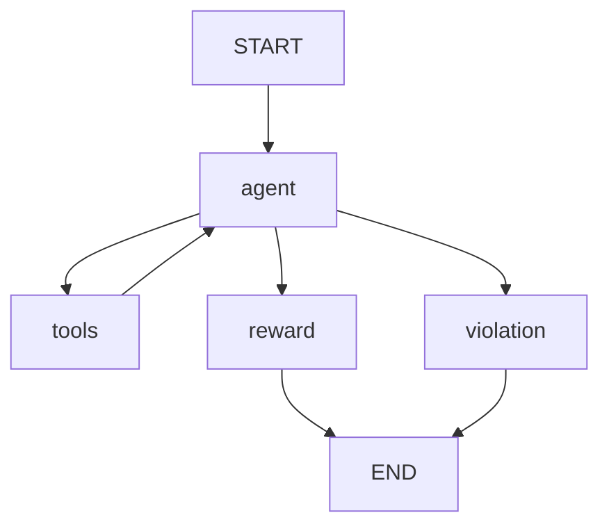

# LangGraph State Machine

This document describes the LangGraph episode that powers each agent run.

## State schema

The state is a dict with these key fields:

- run_id, repo_path, dep_name, from_version, to_version
- baseline_passed, baseline_failed
- messages (list of BaseMessage, appended via add_messages)
- steps_taken, max_steps
- submitted
- final_reward, final_passed, final_failed
- violation

## Flow

## Routing rules

After agent node runs:

1. If the sandbox flagged a violation, route to violation.
2. If the last LLM response contains submit, route to reward.
3. If steps_taken >= max_steps, route to violation.
4. If the last message contains tool calls, route to tools.
5. Otherwise route to violation.

## Agent node

- Builds initial messages from GRAFT_SYSTEM_PROMPT and the run input.
- Invokes the local vLLM chat endpoint with tool bindings.
- Marks submitted if the tool call name is submit.

## Tool node

- Serializes tool args.
- Invokes the tool and records a ToolMessage.
- Adds a step record with timestamp and duration.
- Increments steps_taken once per tool call.

Step records are persisted to AgentRun.steps via the on_step callback in the session.

## Reward and violation nodes

- reward node runs the final evaluation in a fresh sandbox container and calls compute_reward.
- violation node returns a final_reward of -1.0 and records the violation reason.

## Max steps

max_steps is taken from AGENT_MAX_STEPS and acts as a hard budget for tool calls.
