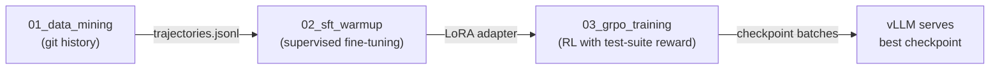

# Training Pipeline

> How to train a Graft agent from scratch: data mining → SFT → GRPO.

---

## Overview

The training pipeline produces a fine-tuned model capable of autonomously upgrading dependencies. It is fully offline — no frontier model calls at any stage.



All notebooks live in `training/` and are designed to run top-to-bottom in JupyterLab (available at http://localhost:8888 via Docker Compose).

---

## Prerequisites

```bash
pip install -r training/requirements.txt
```

Or use the Docker Compose `jupyter` service which has everything pre-installed.

You'll need:
- A HuggingFace token (`HF_TOKEN`) to download the base model
- A GPU with ≥16 GB VRAM for training (≥8 GB for inference only)
- Docker for sandbox execution during GRPO

---

## Notebook 1: Data Mining

**File:** `training/01_data_mining.ipynb`  
**Purpose:** Mine git history from popular open-source repos to produce supervised training trajectories.  
**Output:** `training/data/trajectories.jsonl`

### How it works

1. **Clone repos** — 10 popular OSS projects (Django, Flask, FastAPI, requests, NumPy, Pydantic, SQLAlchemy, Celery, httpx, pytest)

2. **Walk commits** — For each repo, walk up to 2,000 commits looking for candidates that satisfy:
   - Changed a dependency manifest file (requirements.txt, pyproject.toml, package.json, etc.)
   - Changed application code (.py, .js, .ts, .rs)
   - Did NOT only change CI, docs, or test files

3. **Verify fixes** — For each candidate:
   - Check out the bump commit into a temporary worktree
   - Install dependencies in a fresh virtualenv
   - Run the test suite with a 5-minute timeout
   - Keep only commits where tests pass (exit code 0)

4. **Reconstruct trajectories** — Convert each verified diff into a sequence of Graft tool calls:
   - `read_changelog` → fetch real changelog text
   - `edit_file` per changed application file → minimal diff extracted via `difflib`
   - `run_tests` → synthetic passing result
   - `submit` → episode complete

5. **Save** — Write to JSONL with full message history + metadata

### Configuration

```python
TARGET_REPOS = [...]           # List of GitHub URLs
CLONE_DIR = Path("./repos")    # Where repos are cloned
OUTPUT_PATH = Path("./data/trajectories.jsonl")
MAX_COMMITS_PER_REPO = 2000
MIN_TEST_FILES = 3
```

### Output format

Each line in `trajectories.jsonl` is:
```json
{
  "messages": [
    {"role": "system", "content": "..."},
    {"role": "user", "content": "Upgrade requests from 2.31.0 to 2.32.0..."},
    {"role": "assistant", "content": null, "tool_calls": [...]},
    {"role": "tool", "tool_call_id": "...", "content": "..."},
    ...
  ],
  "reward": 1.0,
  "meta": {
    "repo": "...",
    "dep": "requests",
    "from_version": "2.31.0",
    "to_version": "2.32.0",
    "commit": "abc123..."
  }
}
```

---

## Notebook 2: SFT Warmup

**File:** `training/02_sft_warmup.ipynb`  
**Purpose:** Supervised fine-tuning of the base model on mined trajectories.  
**Input:** `training/data/trajectories.jsonl`  
**Output:** `training/checkpoints/sft/` (LoRA adapter weights)

### Training configuration

| Parameter | Value |
|-----------|-------|
| Base model | `Qwen/Qwen2.5-Coder-3B-Instruct` |
| Trainer | `SFTTrainer` (TRL) |
| Epochs | 3 |
| Batch size | 8 (effective 32 with gradient accumulation) |
| Learning rate | 2e-5, cosine schedule |
| Warmup | 5% of total steps |
| Max sequence length | 4096 |
| LoRA rank | 16 |
| LoRA alpha | 32 |
| Target modules | All linear layers |

### Pipeline

1. Load trajectories from JSONL
2. Format into chat template using the model's tokenizer
3. Train/val split (90/10, fixed seed)
4. Train with `SFTTrainer`
5. Plot loss curve (matplotlib, inline)
6. Save adapter to `training/checkpoints/sft/`
7. Quick eval: run 10 held-out trajectories, print pass rate

---

## Notebook 3: GRPO Training

**File:** `training/03_grpo_training.ipynb`  
**Purpose:** Reinforcement learning fine-tuning using Group Relative Policy Optimisation.  
**Input:** SFT checkpoint + GRPO prompt dataset  
**Output:** `training/checkpoints/grpo/batch_{n}/` (periodic checkpoints)

### How GRPO works

For each prompt (an upgrade scenario):
1. Generate **G=8 rollouts** from the current policy
2. Execute each rollout in the Docker sandbox
3. Compute reward using `backend.agent.reward.compute_reward`
4. Normalise advantages within the group (mean=0, std=1)
5. Update policy using the clipped objective with KL penalty

### Training configuration

| Parameter | Value |
|-----------|-------|
| Starting checkpoint | SFT adapter |
| Trainer | `GRPOTrainer` (TRL) |
| Total rollout batches | 2,000 (with early stopping) |
| Group size (G) | 8 rollouts per prompt |
| Learning rate | 2e-6 |
| KL coefficient | 0.02 |
| Max steps per rollout | 50 |

### Curriculum

Scenarios are sorted by difficulty tier:

| Tier | Description | Example |
|------|-------------|---------|
| 1 — Patch | Patch version bump, no breaking changes | 2.31.0 → 2.31.1 |
| 2 — Minor | Minor version with deprecations | 2.31.0 → 2.32.0 |
| 3 — Major | Major version with breaking API changes | 2.x → 3.0.0 |
| 4 — Semantic | Subtle semantic changes (same API, different behaviour) | edge cases |

### Monitoring

Every 100 batches, a matplotlib figure with 5 subplots is logged:
1. Training pass rate
2. Eval pass rate
3. Tampering rate
4. Mean reward
5. KL divergence

### Checkpointing

- Save every 100 batches to `training/checkpoints/grpo/batch_{n}/`
- Early stopping: halt if eval pass rate hasn't improved by 0.01 over the last 300 batches

---

## Checkpoint priority chain

After training, vLLM automatically picks the best available checkpoint:

| Priority | Source | Directory |
|----------|--------|-----------|
| 1st | GRPO | `training/checkpoints/grpo/batch_{highest}/` |
| 2nd | SFT | `training/checkpoints/sft/` |
| 3rd | Base | HuggingFace Hub (`Qwen/Qwen2.5-Coder-3B-Instruct`) |

The selection logic is in `backend/agent/model_loader.py`. Override with `FORCE_MODEL_SOURCE=base|sft|grpo`.

For LoRA checkpoints (SFT/GRPO), vLLM loads them as adapters on top of the base model using `--enable-lora`.

---

## Reward function

The reward signal used in both SFT trajectory labelling and GRPO training:

```python
def compute_reward(
    baseline_passed, baseline_failed,
    final_passed, final_failed,
    steps_taken, violation
) -> float:
    if violation:
        return -1.0

    reward = 0.0
    if final_passed >= baseline_passed and final_failed == 0:
        reward += 1.0                           # all tests pass
    reward += max(0, final_passed - baseline_passed) * 0.05  # bonus
    reward -= max(0, final_failed - baseline_failed) * 0.10  # regression penalty
    reward -= steps_taken * 0.01                 # efficiency pressure
    return round(reward, 4)
```

This function is pure (no I/O, no side effects) and lives at `backend/agent/reward.py`.

---

## Directory structure after training

```
training/
├── repos/                         # Cloned OSS repos (gitignored)
├── data/
│   └── trajectories.jsonl         # Mined SFT data (gitignored)
├── checkpoints/                   # All gitignored
│   ├── sft/
│   │   ├── adapter_config.json
│   │   ├── adapter_model.safetensors
│   │   └── ...
│   └── grpo/
│       ├── batch_100/
│       ├── batch_200/
│       └── ...
├── 01_data_mining.ipynb
├── 02_sft_warmup.ipynb
├── 03_grpo_training.ipynb
├── requirements.txt
└── Dockerfile
```

Training artefacts (`repos/`, `data/`, `checkpoints/`) are in `.gitignore` and should be persisted separately (e.g. mounted as a Docker volume or synced to cloud storage).
